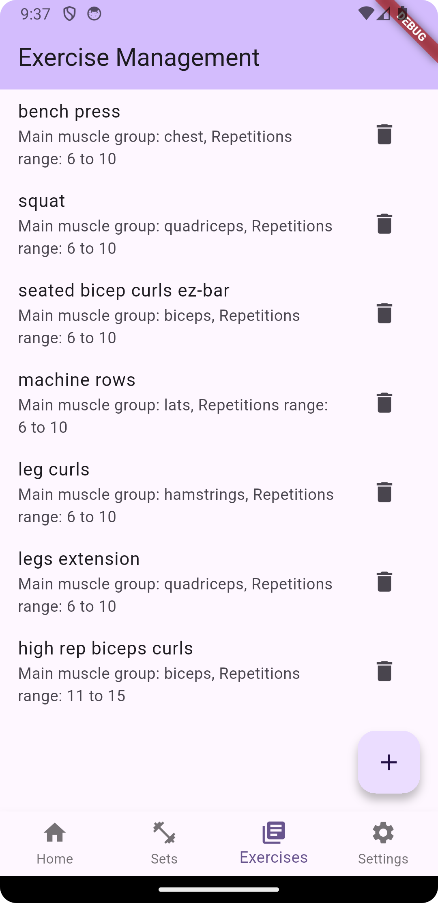
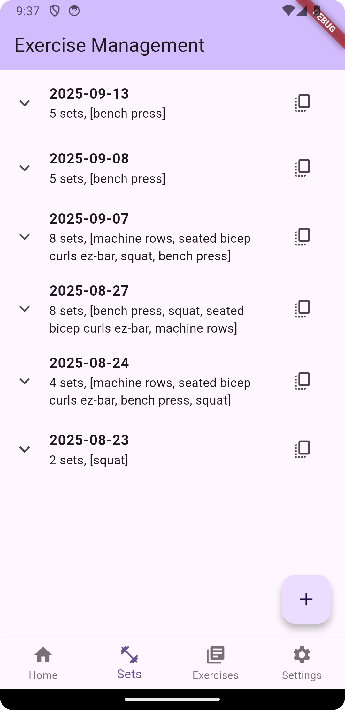
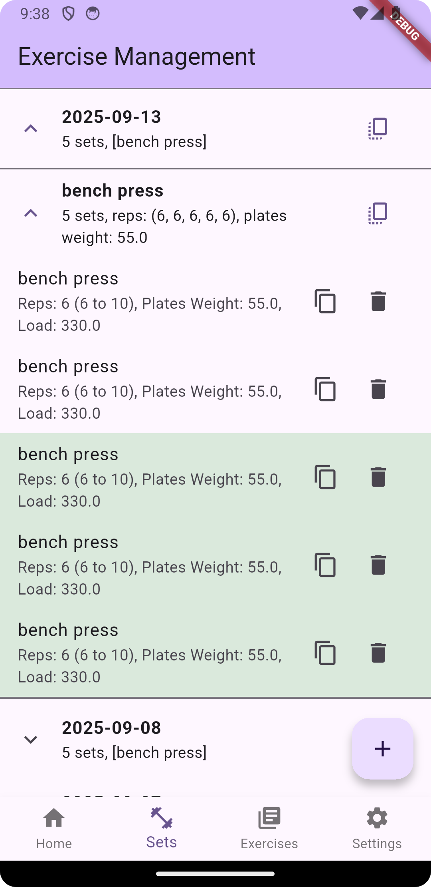
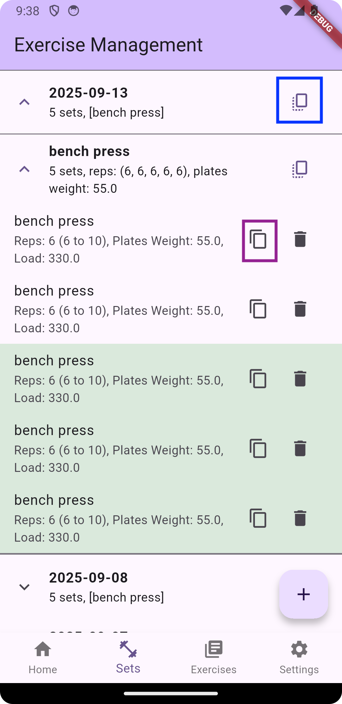

# Exercise Management

A Flutter application for managing exercises, workouts, and routines. This project provides tools to track, organize, and analyze exercise data.

## Features
- Create, edit, and delete exercises
- Track workout history and progress, through exercise sets
- Opinionated progression system for exercises
- Data persistence with local database (allows offline use)
- Extract exercise data into zip files for backup and sharing
- Modular architecture for easy extension
- Clean separation of core, data, and presentation layers

## App Screenshots

Below are some example screenshots of the app.





_The copy icon in the blue square means "copy with progression" in the sets progression screen. The copy icon in the purple square is a "simple" copy._

## Getting Started
### Prerequisites
- [Flutter SDK](https://flutter.dev/docs/get-started/install)
- Dart SDK (usually included with Flutter)

### Installation
1. Clone the repository:
   ```sh
   git clone https://github.com/username/exercise_management.git
   cd exercise_management
   ```
2. Install dependencies:
   ```sh
   flutter pub get
   ```
3. Run the app:
   ```sh
   flutter run
   ```

## Running Tests
To run all unit and widget tests:
```sh
flutter test
```

## Contributing
Contributions are welcome! Please open issues or submit pull requests for improvements and bug fixes.

### Folder Structure
```
lib/
  main.dart                # App entry point
  core/                    # Core utilities and base classes
  data/                    # Data models, repositories, and database
  presentation/            # UI pages, view models, and widgets
android/                   # Android-specific files
build/                     # Build outputs
images/                    # App screenshots and other images
pubspec.yaml               # Project dependencies and metadata
test/                      # Unit and widget tests
```
